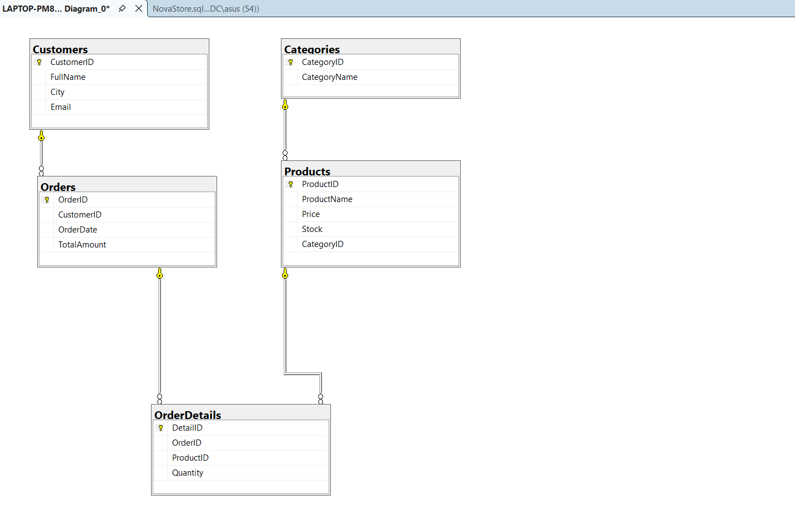

# NovaStore Database Project

## Project Overview

NovaStore is a relational database project designed for an e-commerce platform. The database system is structured to manage and organize key business data such as customers, products, and orders.

This project focuses on designing a structured database architecture and implementing SQL queries to efficiently manage and analyze e-commerce data.

## Database Design

The database was designed using relational database principles. Each table represents an essential entity within the system.

The core entities included in the database are:

* Customers
* Products
* Orders
* Order Details

Relationships between these tables are established using **Primary Keys** and **Foreign Keys** to ensure data consistency and integrity.

## SQL Concepts Used

The project demonstrates several important SQL concepts and techniques including:

* Table creation and database schema design
* Data insertion and management
* Data retrieval using SELECT statements
* Multi-table queries using JOIN operations
* Data grouping using GROUP BY
* Nested queries using Subqueries
* Data analysis using Aggregate Functions

These SQL queries allow the system to generate useful reports such as sales analysis, customer order history, and product performance.

## Database Schema

The diagram below illustrates the relationships between the tables used in the NovaStore database.



## Example SQL Queries

The project includes SQL queries used for:

* Retrieving customer order history
* Analyzing product sales
* Calculating total revenue
* Identifying top-selling products
* Generating reports based on customer and order data

## Project Structure

```
NovaStore/
 ├── NovaStore.sql
 ├── SebanurDark_NovaStore_Proje.png
 └── README.md
```
